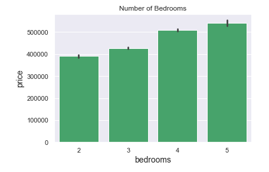
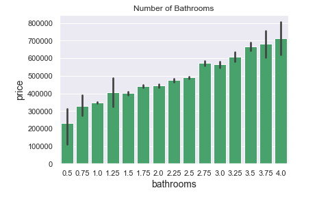
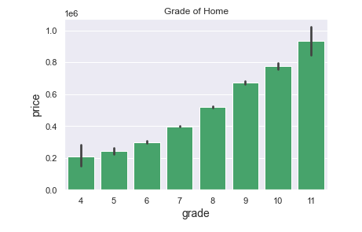
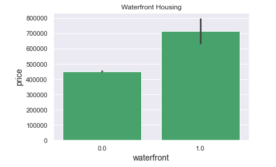
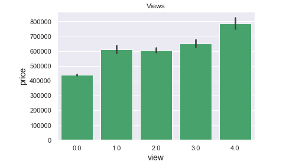

# Sell Your Home For More: King County Homes

## Using OLS Regression to identify factors that increase the sale price of a home.

**Author**: Lauren Esser

The contents of this repository detail an analysis of my Mod 2 project. This analysis is detailed in hopes of making the work accessible and replicable.

<div class='tableauPlaceholder' id='viz1609174484296' style='position: relative'><noscript><a href='#'></a></noscript><object class='tableauViz'  style='display:none;'><param name='host_url' value='https%3A%2F%2Fpublic.tableau.com%2F' /> <param name='embed_code_version' value='3' /> <param name='site_root' value='' /><param name='name' value='Pricevs_Zipcode&#47;Sheet1' /><param name='tabs' value='no' /><param name='toolbar' value='yes' /><param name='static_image' value='https:&#47;&#47;public.tableau.com&#47;static&#47;images&#47;Pr&#47;Pricevs_Zipcode&#47;Sheet1&#47;1.png' /> <param name='animate_transition' value='yes' /><param name='display_static_image' value='yes' /><param name='display_spinner' value='yes' /><param name='display_overlay' value='yes' /><param name='display_count' value='yes' /><param name='language' value='en' /><param name='filter' value='publish=yes' /></object></div>                <script type='text/javascript'>                    var divElement = document.getElementById('viz1609174484296');                    var vizElement = divElement.getElementsByTagName('object')[0];                    vizElement.style.width='100%';vizElement.style.height=(divElement.offsetWidth*0.75)+'px';                    var scriptElement = document.createElement('script');                    scriptElement.src = 'https://public.tableau.com/javascripts/api/viz_v1.js';                    vizElement.parentNode.insertBefore(scriptElement, vizElement);                </script>

### Business problem: 
Can we identify factors that increase the sales price of homes in King County, WA?

Selling a home can be stressful, homeowners ask themselves the question "What can I do to increase the value of my home?" Not knowing where to start may be a waste of time and money. During this project I worked on tackling that exact question for homeowners. Using the King County House Dataset I identified with 75% accuracy which features home owners can focus on in order to sell their place of residence at a higher price point.


### Data
Data comes from Kaggle.com titled "House Sales in King County, USA". [Linked Here](https://www.kaggle.com/harlfoxem/housesalesprediction) To access data select the Download button on the right side of screen. The dataset contains 21 different features listed and explained below:

<div class="alert alert-block alert-info"> 
* *id* - identification for each home
* *date* - date house was sold
* *price* - is the prediction target
* *bedrooms* - number of bedrooms in the home
* *bathrooms* - number of bathrooms in the home
* *sqft_living* - square footage of the home
* *sqft_lot* - square footage of the lot
* *floors* - total floors or levels in the home
* *waterfront* - if the house has a view of waterfront
* *view* - number of viewings the property received
* *condition* - overall condition of home. 1 = worn out; 5 = excellent
* *grade* - classification by construction quality which refers to the types of materials used and the quality of workmanship. Better quality equals higher grade.
* *sqft_above* - square footage of home apart from basement
* *sqft_basement* - square footage of basement
* *yr_built* - year the home was built
* *yr_renovated* - year the home was renovated
* *zipcode* - zipcode location
* *lat* - latitude coordinate
* *long* - longitude coordinate
* *sqft_living15* - square footage of living space for nearest 15 neighbors
* *sqft_lot15* - square footage of the lot for nearest 15 neighbors.
</div>

### Methods
Throughout this OLS Regression Analysis I used the OSEMN framework to help guide my decisions. 
1. *Obtain Data*
* Data was obtained from Kaggle [here](https://www.kaggle.com/harlfoxem/housesalesprediction)
* While uploading the data I also:
    * Checked for duplicates - many homes sold more than one time.
    * Dropped id column - Not needed for model.
    * Inspected information about dataset.
    
2. *Scrub* 
During the Scrub section of my analysis I began by taking a look at the categorical variables. The two categoricals where sqft_basement and date. I took sqft_basement and assigned any ? as 0.0 assuming the home did not have a basement. 
```df.sqft_basement = df.sqft_basement.replace('?', '0.0')```

I then converted this categorical column to a float. 

```df.sqft_basement = df.sqft_basement.astype('float')```

After taking care of the categorical information I took a look at the nulls within the dataset. 


As shown above, the majority of nulls were precent in waterfront and yr_renovated. 
When taking care of nulls I went through the three columns one by one to make careful decisions. Some of the choices I made include replacing ? with 0, fill Nan with 0, and drop rows if less than 5% of column. The last step of my Scrub process was to check for abnormal symbols or characters.

Code to check for abnormal symbols or characters:
```
for col in df.columns:
    try: 
        print(col, '\n', df[col].value_counts(normalize=True).head(), '\n\n')
    except:
        (print(col, df[col].value_counts()))
```
I did not find any abnormalities within the data. 

3. *Explore* 
I had three questions that I wanted to answer within the Explore section of my notebook. 
* Is there multicollinearity among features?
ANSWER: We can see that there is multicollinearity among features in the data set. Using a combination of the correlation method and the vif method we were able to see that many columns had an issule with multicollinearity. By dropping these columns the multicollinearity dropped from 2.84e+08 to 2.99e+07.

* Do outliers impact the overall model?
ANSWER: When I first removed all the outliers in the dataset I was left with hardly anything to work with. (about 4000 rows) When I went back and only removed the outliers for price my R2 value rose and my multicollinearity dropped. This shows that removing outliers does have an impact on models and it is in the hands of the data scientist to make the correct choices.

* Does log transformation improve the overall model?
ANSWER: By observing the sixth and seventh OLS Regression Analysis, we are able to see that log transformation improved the R^2 value and dropped the multicollinearity. This shows that log transformation can impact the overall model positively.

I began my Explore section by taking the time to look at joint graphs comparing the different columns to that of the target, price. To do this I made the below function which was then used with @interact for ease of accessing different plots.

First create function:
```
def joint_graphs(df, col, target = 'price'):
    '''insert dataframe, column, and target in order to create a
    jointplot comparing the col to the target'''
    sns.set(rc={'axes.labelsize': 14})
    sns.set_palette("BuGn_r")        
    joint = sns.jointplot(data = df, x = col, y=target,
                          kind='reg', height = 7)
                          
    plt.suptitle(f" Comparing {col} and {target}", fontsize = 14)
    return joint
```
Import interact and use with function:
```
from ipywidgets import interact

@interact
def show_plot(col=num_cols):
    joint_graphs(df, col)
```

Sometimes the Explore Section and Model Section can overlap. It is here I chose to run my initial model using statsmodels to fit the data using OLS Regression analysis. 


Other items conducted within the Explore Section:
* One hot encoded categorical columns (zipcode and condition)
* Checked for multicollinearity - checked for over .75 multicollinearity and used vif.
* Examined outliers - looked at zscore and IQR. Used IQR to removed outliers.
* Removed high p-values (greater than .05).
* Ran multiple models to check for improvement

4. *Model* 
To being the Model process I took a look at how removing specific outliers have an impact on our Model. Under the label Fifth OLS Regression within the Jupyternote book you will be able to see how dropping specific outliers either increase or decreased multicollinearity and R2 score.

Other items conducted within the Model phase:
* Ran log transformation to improve normality
* Ran regression model validation using train_test_split
* Ran multiple models to check for improvement

5. *Interpret* 
* Discussion of findings.
* Recommended improvements: increase number of bedrooms and bathrooms, use high grade material while building, purchase a house that is waterfront, have at least 3 viewings before selling your home, and consider location.
    


### Results

Below we can see that the location of the home plays a large role in how much the house sells for. Properity in the north part of the county sells for much more than the south side.

**Zipcode vs Price of Home**


The first model was created using OLS analysis through statsmodels.formula.api. Seen below, we began with an R-squared of .809. Although this number appears high, when we look at our QQ-plot we can see there are extreme outliers than need to be taken care of.

**First OLS Model**


Throughout the jupyter notebook I tried to improve the OLS analysis and QQPlot by removing outliers, checking for multicollinearity, and performing log transformation. Pictured below is the final OLS Analysis of the King County Housing Data. The R-squared value ended at .792 and a QQPlot with light tails. 

**Final OLS Model**


### Recommendations:
Based on found regression model stakeholders should:
1. Increase the number of bedrooms and bathrooms in the home




2. Use high grade material while building



3. Purchase a house that is waterfront



4. Have at least 3 viewings before selling the home



5. Consider location.


### Limitations & Next Steps

Given the opportunity with this project I would love to see the impact school districts, walkability, type of home, and time of year the house was sold have on the selling price of a home. 


### For further information
Please review the jupyter notebook or presentation for more information.

For any additional questions, please contact **Lauren.Esser02@gmail.com** or reach out via [LinkedIn](https://www.linkedin.com/in/laurenesser/))

### Repository Structure:

* README.md                       <- README for reviewers of this project.
* housing_final.ipynb             <- narrative documentation of analysis in jupyter notebook
* presentation.pdf                <- pdf version of project presentation

 
 


